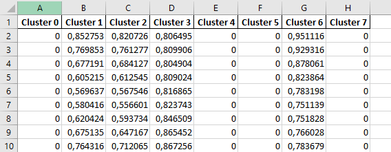

.. _usage_dataset:

*******
Dataset
*******

.. _introduction_dataset:

Introduction
============

A dataset has different components. It contains commodities, as which energy source is used in the energy system, and the regions, your energy system is based on.
Furthermore the dataset consists of energy sources, sinks, storages, conversions and transmissions.

With one dataset several modeling runs can be performed.

.. _newDataset:

Create a new dataset
====================
To create a new dataset, the API REST interface ``POST /datasets/`` is addressed. The following parameters should be
provided:

- `name`: name of the dataset

- `description`: description of the dataset

The endpoint returns the id of the new dataset. The id will be needed in the following steps.

A full documentation of the API is available `as redoc documentation <https://http://10.13.10.51:9000/redoc>`_.

.. openapi:: ./../generated/openapi.json
   :paths:
      /datasets/

By default only you have access to this dataset.
If you want to share the dataset with other users,
you have to grant permissions to them as described :ref:`here <dataset_permissions>`.

.. _provideData:

Provide data
============
There are two ways to add data to a dataset. For both ways you need to provide the id of the dataset.

ZIP-Upload
----------
With the Zip-Upload, we've created a way to enter the data in the database with only one use of a API REST interface.
Once a zip archive is created in a certain format and with certain files, it can be uploaded with the API REST interface.
A dataset id is needed.

.. openapi:: ./../generated/openapi.json
   :include:
      /datasets/*/upload

The zip archive contains other files and folder in which the regions, commodities and components to the energy system
are described. The zip archive is structured as follows:

.. code-block:: bash

   dataset.zip
    │   commodities.json
    │   regions.json
    ├───conversions/
    ├───sinks/
    ├───sources/
    ├───storages/
    └───transmissions/

The ``commodities.json`` contains all commodities, which are used in the energy system.
The json file is structured as a list of commodities with name, unit and description.
The unit is used for all values in the energy system with that specific commodity.
Example:

.. code-block:: json

   [
       {
           "name": "electricity",
           "unit": "kWh",
           "description": "example description"
       },
       {
           "name": "heat",
           "unit": "kWh"
       }
  ]

The ``regions.json`` contains all regions, which are used in the energy system.
The json file is structured as a list of regions with name and description. Example:

.. code-block:: json

   [
       {
           "name": "region1",
           "description": "example description"
       },
       {
           "name": "region2"
       }
  ]

For each of the sections for energy sources, sinks, storages, conversions and transmissions exists a folder.
These folders contain other folders that are used as a listing of the various objects.

.. code-block:: bash

   dataset.zip
    └───sources/
        ├───source-1/
        │       capacity.xlsx
        │       operationRateMax.xlsx
        │       source.json
        └───source-2/
                capacity.xlsx
                operationRateFix.xlsx
                source.json

For example, there are two folders in the source folder that contains data for two different energy sources.
A folder that maps an object contains a .json file that contains the parameters for the object, which are the same across all regions.

.. code-block:: json

   [
       {
           "name": "wind onshore",
           "description": "source for the wind onshore plants",
           "commodity": "electricity",
           "capacity_variable": true,
           "invest_per_capacity": 1.1,
           "opex_per_capacity": 0.022,
           "interest_rate": 0.08,
           "economic_lifetime": 20
        }
   ]

If there are parameters that are different for each region, these parameters (for example
capacity per region, operation rates, ...) are stored in one Excel file each.
Each region is mapped as a column and the value (or values as a time series) is stored in the column according to the region.
Here is an part of such an excel file which contains a time series for a region.

The parameter that are needed for each object are documented :ref:`here. <dataset_description>`.
All of the parameters can be set, but not all of them have to.

To show the structure of the zip file, we have created an example. This can be found `here <https://github.com/NOWUM/EnSysMod/tree/main/examples/data/dataset-1/>`_.

Upload data per REST API interfaces individually
------------------------------------------------
Another way is to upload the data in small pieces via the individual REST interfaces. A list of the interfaces can be found :ref:`here. <rest_endpoints>`

Retrieve data
=============
After adding some data to the database, you can retrieve the data. You can use the zip download or the REST API.

ZIP-Download
------------
The zip download allows you to download the data in a zip archive for a dataset.
Therefore you need to provide the dataset id.

.. openapi:: ./../generated/openapi.json
   :include:
      /datasets/*/download

The zip archive contains files and folders in which the regions, commodities and components of the energy system are stored. The zip archive is structured as follows:

.. code-block:: bash

   dataset.zip
    │   commodities.json
    │   regions.json
    ├───conversions/
    ├───sinks/
    ├───sources/
    ├───storages/
    └───transmissions/

You can modify the data inside the zip archive locally and use the zip upload (again) to commit your changes.

To show the structure of the zip file, we have created an example.
This can be found `here <https://github.com/NOWUM/EnSysMod/tree/main/examples/data/dataset-2/>`_.

Access data per REST API interfaces individually
------------------------------------------------
Another way is to access the data in small pieces via the individual REST interfaces. A list of the interfaces can be found :ref:`here. <rest_endpoints>`