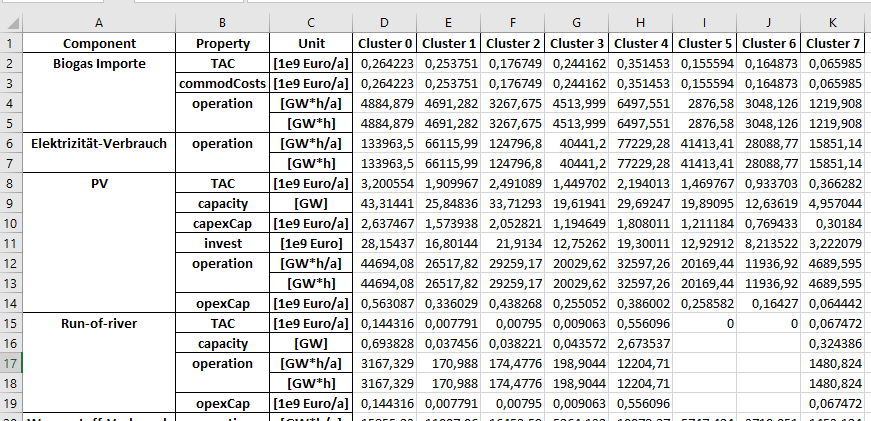
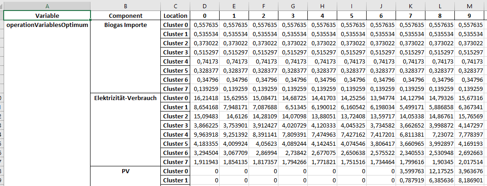

**************
Optimize model
**************

The following article describes how to optimize the model based on a dataset.
The EnSysMod uses the FINE framework inside to optimize the model for lowest total costs.

All restrictions (like CO2 limit) are taken into account.

Model validation
================
The validation endpoint allows to validate the dataset and model parameters. All energy components are transformed to
a energy system model (esm) from FINE. If any parameters are missing or invalid, the validation endpoint returns an
error.

.. openapi:: ./../generated/openapi.json
   :paths:
      /models/{model_id}/esm

Model optimization
==================

When the model is validated you can use the optimization endpoint to optimize the model.

After transforming the dataset to an energy system model by FINE, the model is optimized with the GUROBI solver (or
a free solver alternative).

.. openapi:: ./../generated/openapi.json
   :paths:
      /models/{model_id}/optimize

The optimization endpoint returns the optimized model as excel file. The output is described below.

Result of optimization
======================

The Excel file that you receive as a result contains several spreadsheets. A spreadsheet refers to one of the categories Sink & Source, Conversion, Storage and Transmission.
Currently, each of the categories has three spreadsheets. The structure of these three sheets is the same, but the contained values have to be considered in a different context.

Of particular interest are the spreadsheets "<category>OptSummary_1dim". The rest can be neglected.

All spreadsheets are structured as one kind of table.

One spreadsheet is called "<category>OptSummary_1dim". 
This is the summary of the category. It lists the various components that were specified in the dataset, with the respective parameters to them that were determined as part of the optimization.
The structure looks roughly like this: 

The first 3 columns contain the component (e.g. source-1, source-2, ..), the corresponding parameters and the unit of the parameter. The following columns contain the values for the corresponding regions.
These data are broken down for the different regions. I.e. there is no direct data for the entire system, but for the individual regions or countries.

The following data are output for sources:

- `TAC`: total costs, i.e. investment and operating costs
- `capacity`: installed capacity 
- `capexCap`: investment costs
- `invest`
- `operation`: generation per specified period and per year
- `opexCap`: operating costs
- `commodCosts` (only specified for imports): cost of imports

Sinks have listed the following data:

- `operation`: consumption per specified period and per year.

A conversion has the same data as a source, but commodCosts are omitted.

A storage has the same data as a conversion. Instead of operation, however, a storage has data on operationCharge and operationDischarge (i.e. how much the storage injects and withdraws).

A transmission, like a conversion, has the same data, without the commodCosts, as a source.

If you are interested in data for the whole system, you have to calculate it yourself.

The next spreadsheet is called "<category>_TDoptVar_1dim". 
In this the optimal values for the operation per region and per time step is indicated. As an exception, the operationCharge and operationDischarge are listed for Storage instead of the operation.
The first two columns contain the operation that were optimized and the component to which the values belong. In the 3rd column then per component, the names of the regions are listed, to which then in the following columns for the time steps the values stand.
The table structure to the transmissions has as 3rd and also as 4th column the regions listed, however these are the regions between which there is a connection to the transmission of the commodities. From the 5th column on, the values per time step are entered.

The last of the 3 spreadsheets is called "<category>TIoptVar_1dim". 
This is like the spreadsheet "<category>_TDoptVar_1dim", only that not the operation is shown, but the capacity. But since the capacity remains the same over all time steps, the 3rd column is omitted and the regions with the corresponding capacity are listed in the following columns.
Also in this table the structure for transmission has a different structure. In the 3rd column the regions are listed. Together with the following columns a matrix is formed.

.. image:: ./../images/TIoptVar_1dim_example.PNG
    :alt: structure of the spreadsheet "<category>TIoptVar_1dim"

The last table sheet concerns Other things.